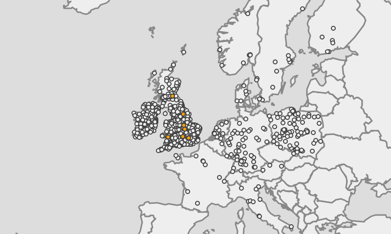

# parkstats: stats for parkrun!

**Disclaimer**: please note that this project is in no way affiliated with or endorsed by [Parkrun](https://www.parkrun.com) - it's just a silly little project by an avid parkrunner and computer geek :)

## About

A webextension that adds extra functionality (and by that I mean gimmicks and eye-candy) to the parkrun website, namely:

- a map with a toggle to show either all or only completed parkruns as well as summary information for completed parkruns (access from the link added below the 'view all stats for this parkrunner' button on a parkrunner's summary statistics page)

- [parkrun bingo](https://www.parkrun.org.uk/cranleigh/news/2020/07/11/are-you-playing-or-will-start-parkrun-bingo/) progress for every parkrunner added to the bottom of their 'all results' page

## Installation
At the moment you just have to install this manually by going to `about:debugging` on Firefox (Chrome is as of yet completely untested) but the plan is to make it available in a slightly less painful way.

## Translations
I have made a vain attempt to internationalise this so that it fits in with the various non-English parkrun websites but if you can offer any improvements over the current translations (or can help with the Japanese translation as I have no idea where to even start with that) please submit a pull request!
